# Linux HA Cluster - Production-Grade Infrastructure Platform


## Overview

This project implements a **production-grade 3-node High Availability cluster** deployed on OpenStack. The infrastructure provides automatic failover, zero-manual-intervention recovery, real-time monitoring, centralized log aggregation, block-level data replication, a full GitOps CI/CD pipeline, and CIS benchmark security hardening.

The entire stack is provisioned and configured using **Ansible**, following Infrastructure-as-Code best practices. Every component is version-controlled, documented, and reproducible from a single command.

## Architecture
node01 (10.10.10.19)     - Quorum voter + DRBD primary
node02 (10.10.10.173)    - Standby node + DRBD secondary
node03 (10.10.10.115)    - Active node + Control plane
VirtualIP (10.10.10.200) - Floating between nodes
Network: test-network-02 (10.10.10.0/24) on OpenStack Neutron

## Layer Summary

| Layer | Component | Status |
|---|---|---|
| 1 | Ansible automated provisioning | Production ready |
| 2 | HA Cluster - Pacemaker + Corosync | Tested - 1 second RTO |
| 3 | Prometheus + Grafana monitoring | All 3 nodes monitored |
| 4 | Loki + Promtail log aggregation | All 3 nodes logs centralized |
| 5 | Alertmanager - 4 alert rules | NodeDown alert tested and verified |
| 6 | DRBD block replication | Zero data loss verified |
| 7 | Gitea + Drone CI pipeline | Automated build on every push |
| 8 | Security hardening - CIS benchmark | Lynis score 71/100 |

## Technology Stack

| Layer | Technology | Purpose |
|---|---|---|
| High Availability | Pacemaker + Corosync | Cluster management and heartbeating |
| Virtual IP | IPaddr2 resource agent | Floating IP between nodes |
| Web Server | nginx | HTTP service managed by Pacemaker |
| Load Balancer | HAProxy | Traffic distribution |
| Data Replication | DRBD Protocol C | Synchronous block-level replication - zero RPO |
| Automation | Ansible | Full infrastructure provisioning - 8 roles |
| Monitoring | Prometheus + Node Exporter | Metrics collection from all nodes every 15s |
| Alerting | Alertmanager | 4 production alert rules |
| Dashboards | Grafana | Real-time visualization and log querying |
| Log Aggregation | Loki + Promtail | Centralized logging from all nodes |
| Git Server | Gitea | Self-hosted Git repository management |
| CI/CD Pipeline | Drone CI | Automated pipeline on every push |
| Security | Fail2ban + CIS Benchmark + Lynis | Intrusion prevention + compliance hardening |
| Infrastructure | OpenStack | Private cloud environment |

## Failover Results

| Metric | Value |
|---|---|
| RTO (Recovery Time Objective) | **1 second** |
| RPO (Recovery Point Objective) | 0 (no data loss) |
| Failover method | Automatic (no human intervention) |
| Detection time | ~3 seconds (Corosync heartbeat) |
| Resource migration | VirtualIP + nginx + HAProxy move together |

## Security Hardening Results

| Control | Implementation |
|---|---|
| Intrusion prevention | Fail2ban - bans IPs after 3 failed SSH attempts |
| SSH hardening | Root login disabled, password auth disabled, MaxAuthTries 3 |
| CIS benchmark | 15+ Level 1 controls implemented via Ansible |
| Network hardening | IP forwarding disabled, SYN cookies enabled, martian logging |
| Audit logging | auditd tracking changes to critical system files |
| Password policy | Min 14 chars, 90 day expiry, complexity requirements |
| Lynis audit score | **71/100** (improved from baseline 65) |

## Screenshots

### Cluster Failover - node01 Offline
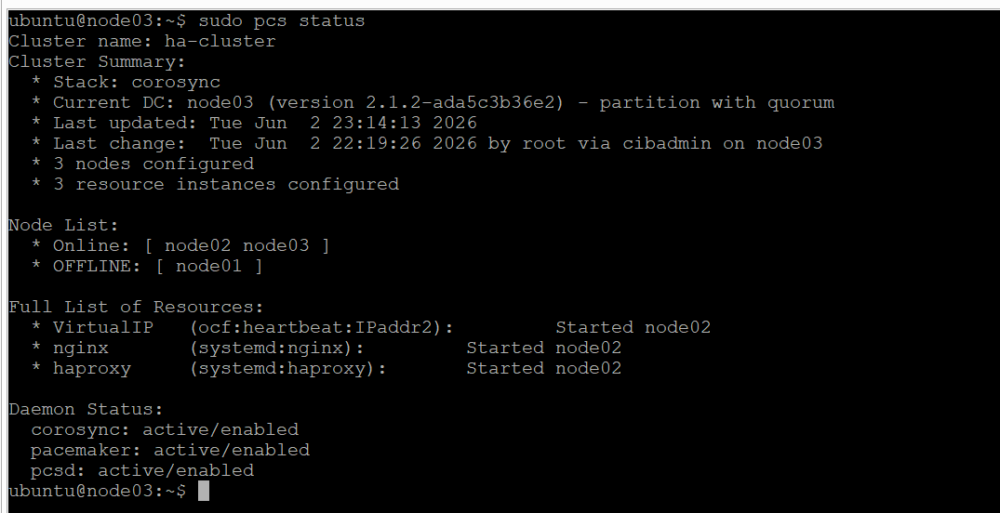

### Ping Test - 1 Second RTO
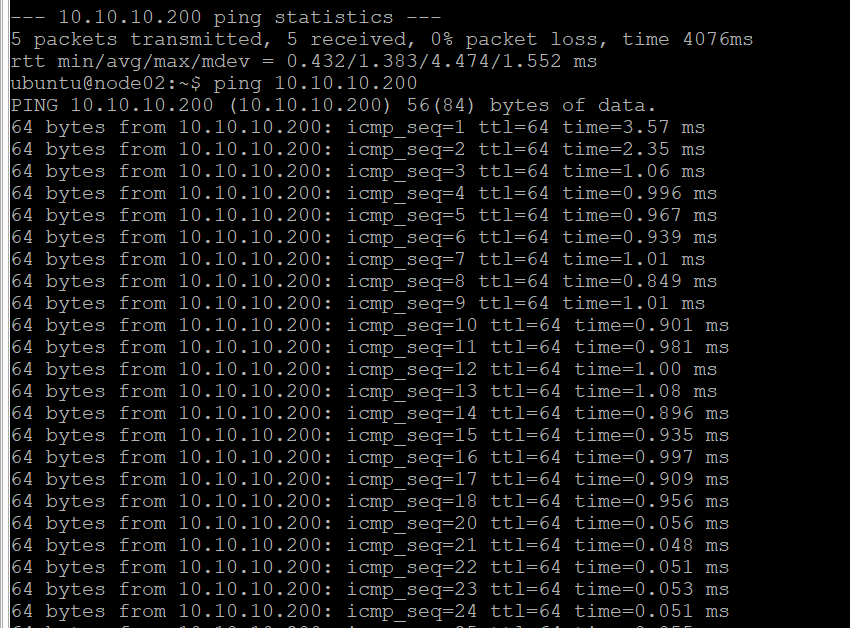

### Cluster Recovery - All Nodes Online
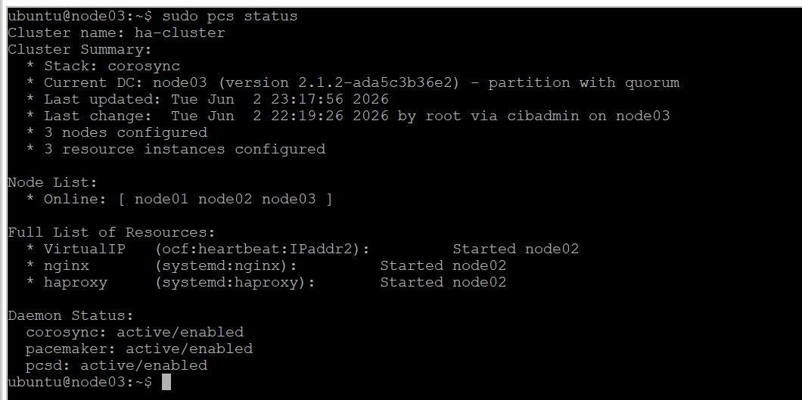

### Grafana Monitoring - node01
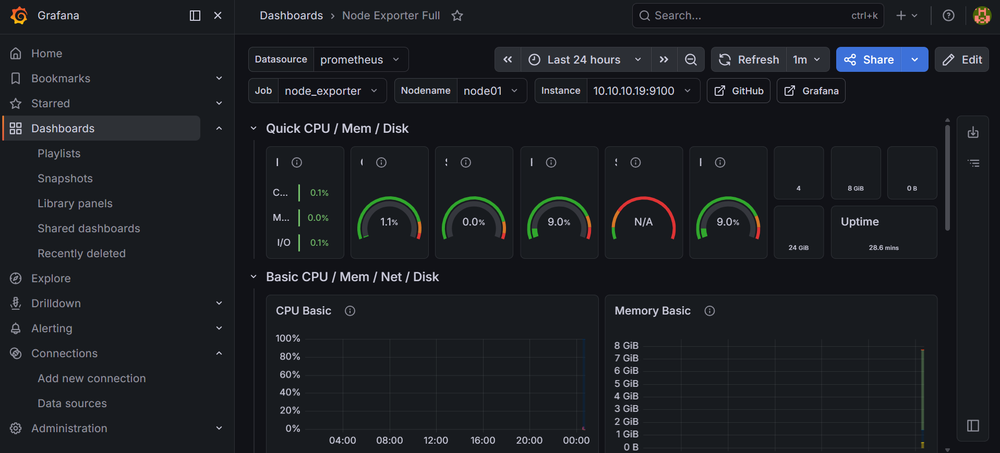

### Grafana Monitoring - node02
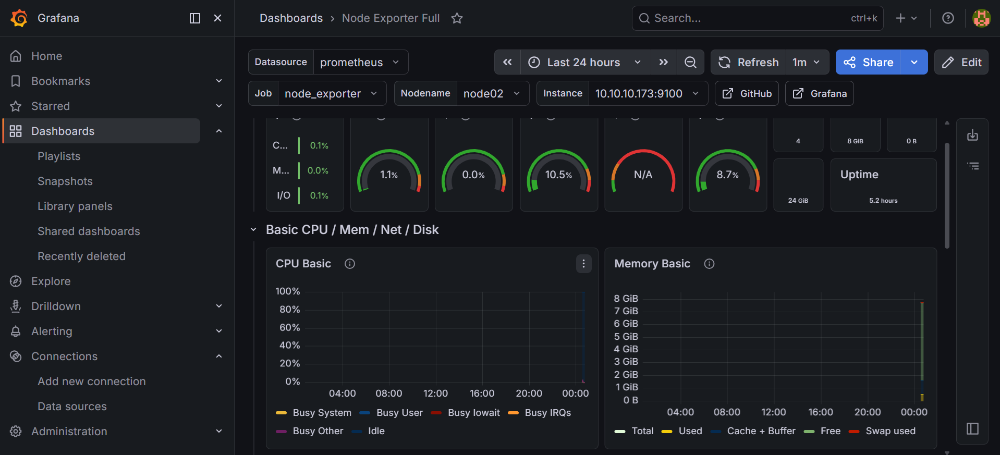

### Loki Centralized Logging
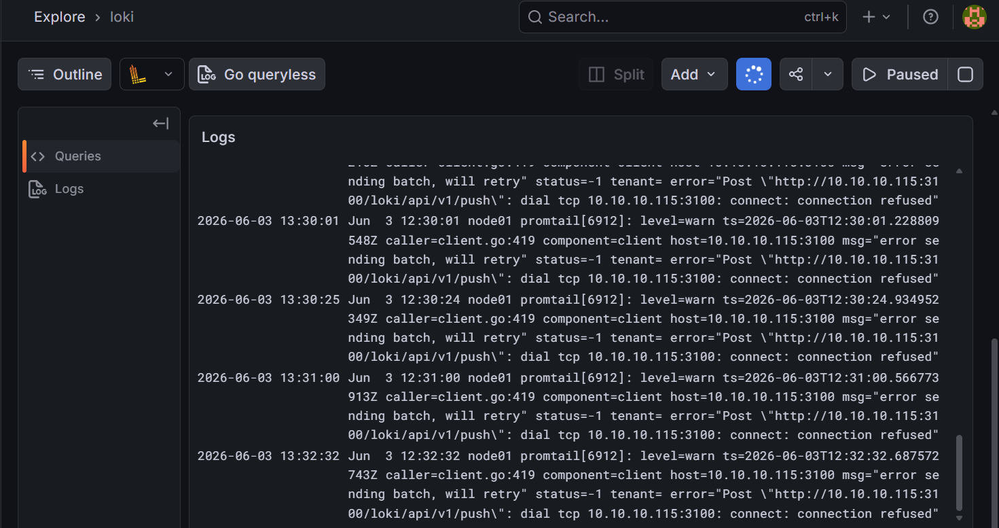

### Alertmanager - NodeDown Alert Firing
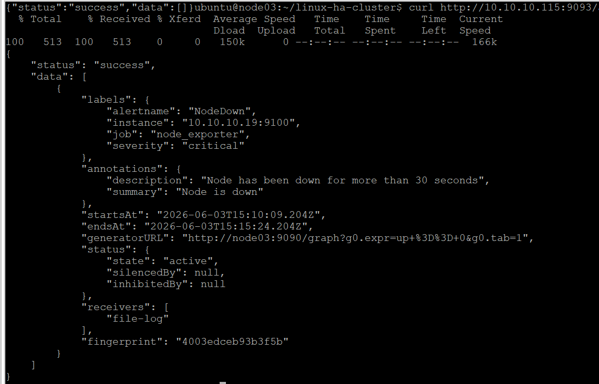

### Grafana Alert Rules
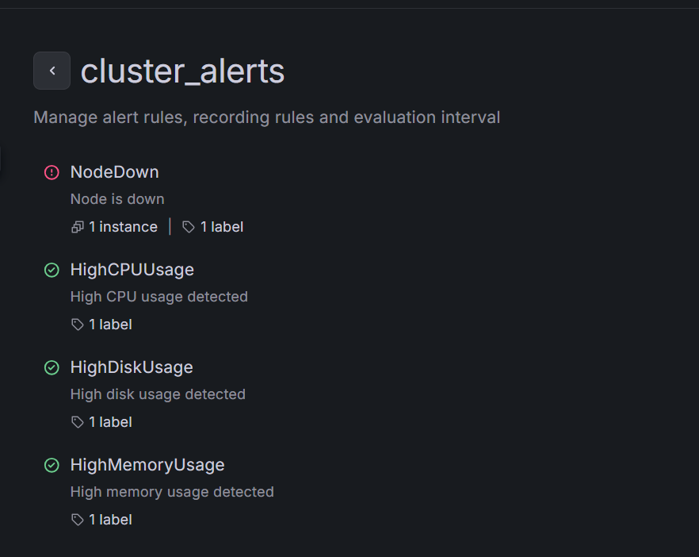

### DRBD Replication - node02 Proof
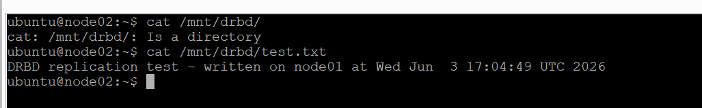

### DRBD Replication - node01 Read


### Drone CI Pipeline Success
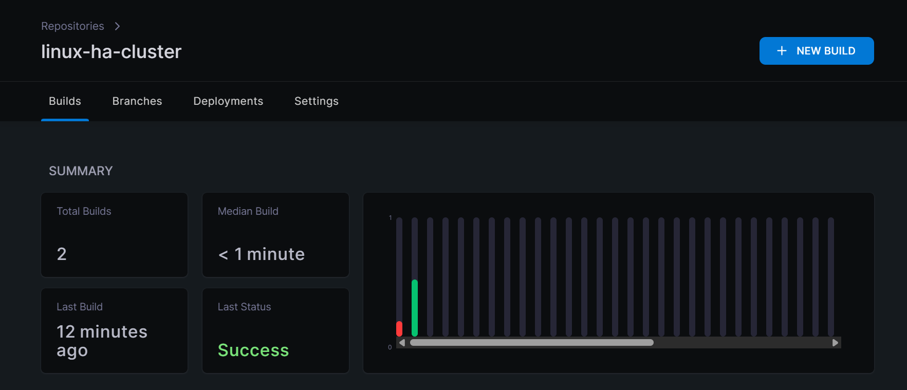

### Fail2ban SSH Protection
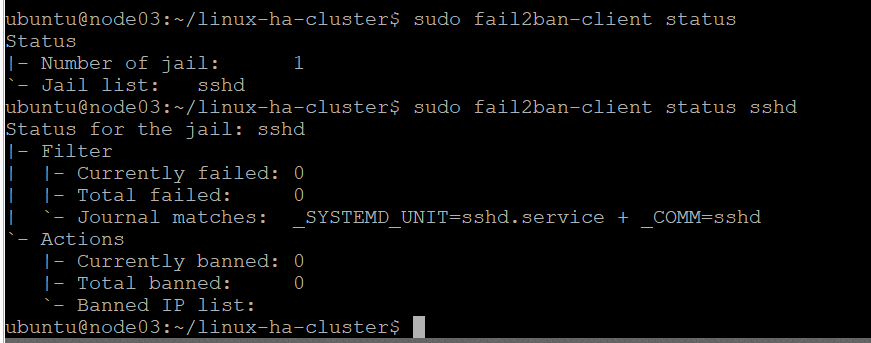

### Lynis Security Score - Baseline 65


### Lynis Security Score - Improved 71


## Project Structure

```
linux-ha-cluster/
├── ansible/
│   ├── inventory.ini
│   ├── site.yml
│   └── roles/
│       ├── common/
│       ├── pacemaker/
│       ├── monitoring/
│       ├── logging/
│       ├── alertmanager/
│       ├── drbd/
│       ├── gitea/
│       └── security/
├── docs/
│   ├── architecture.md
│   └── troubleshooting.md
├── screenshots/
└── README.md
```

## How to Deploy

### Prerequisites
- 3 Ubuntu 22.04 VMs on the same network
- Ansible installed on the control node
- SSH key access to all nodes

### Deploy

```bash
git clone https://github.com/Abderraoufzekkour/linux-ha-cluster.git
cd linux-ha-cluster
vim ansible/inventory.ini
ansible-playbook -i ansible/inventory.ini ansible/site.yml
```

## Documentation

- [Architecture Documentation](docs/architecture.md)
- [Troubleshooting Guide](docs/troubleshooting.md)

## Challenges and Solutions

| Challenge | Solution |
|---|---|
| OpenStack Neutron blocking VirtualIP traffic at network level | Identified port security as root cause and configured allowed address pairs on all 3 VM ports via OpenStack Neutron API - traffic was silently dropped without any error from Pacemaker |
| DRBD split-brain prevention in virtualized environment | Configured Protocol C synchronous replication ensuring zero data loss - managed primary/secondary role transitions manually to prevent dual-primary corruption |
| Prometheus alert rules conflicting with Ansible Jinja2 templating engine | Prometheus uses double curly braces for label variables which Ansible interprets as its own template syntax - resolved by escaping the annotation variables |

## Author

**Zekkour Abderraouf** | Infrastructure & Cloud Engineer

- GitHub: [Abderraoufzekkour](https://github.com/Abderraoufzekkour)
- Email: abderraoufzekkour05@gmail.com
